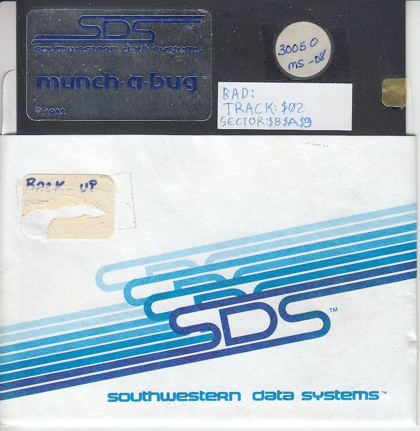
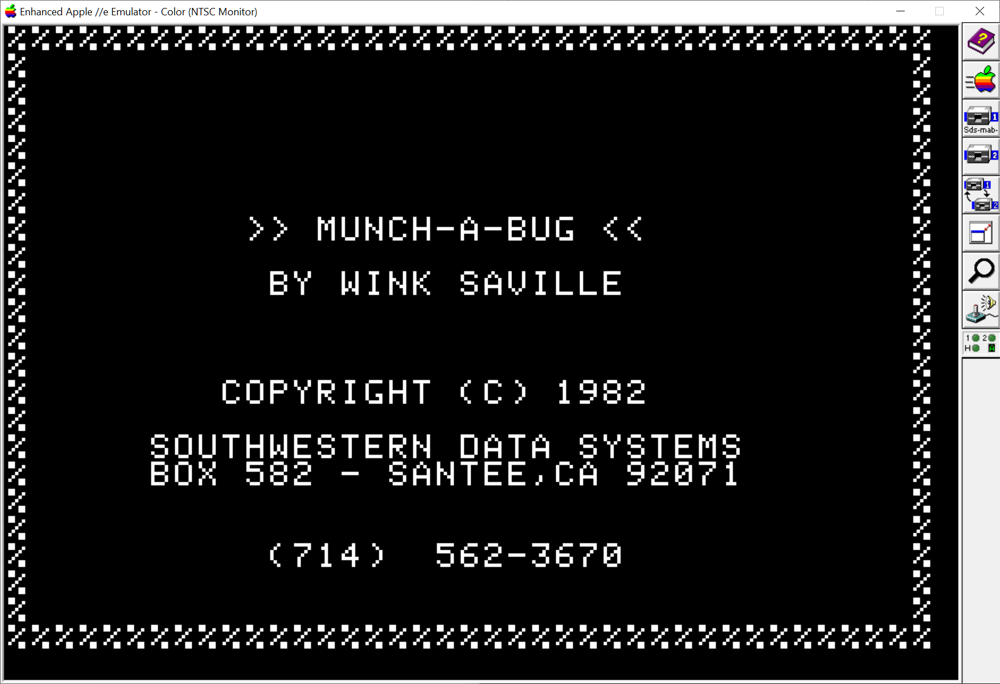
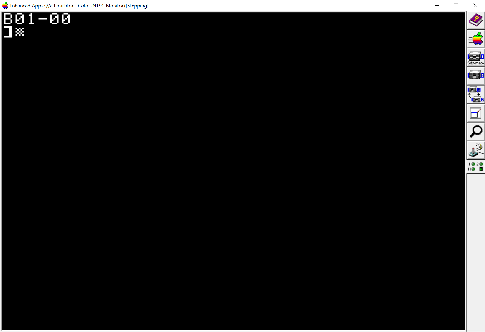
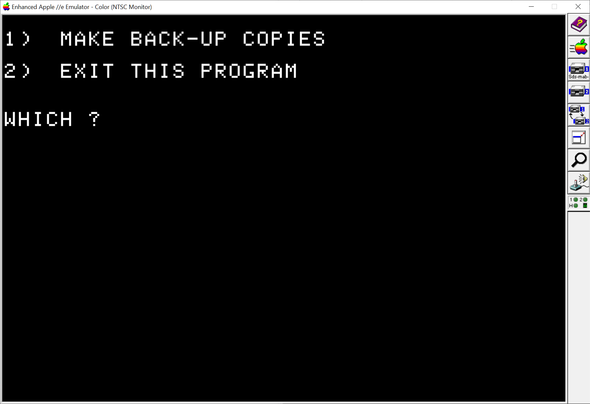
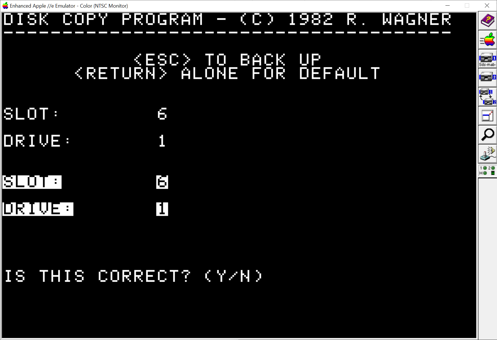
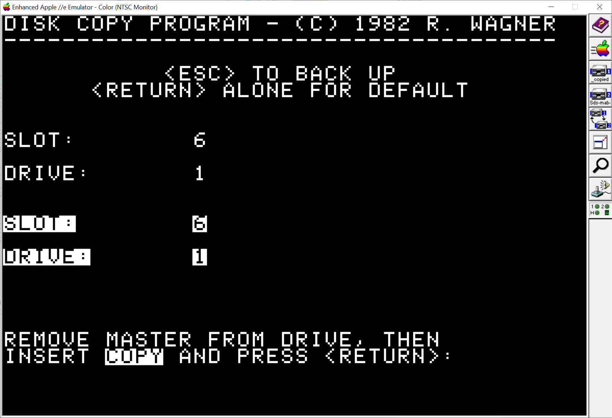
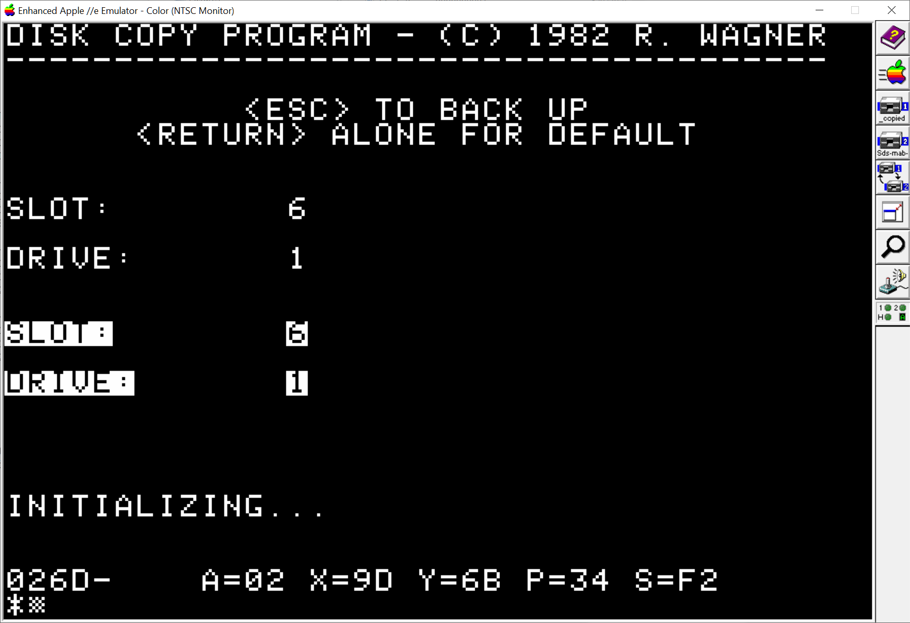

# Munch-A-Bug Table-of Contents

* Intro
* Problem
* Sector Analysis
  * Disk Usage
  * Filenames
    * Filenames with Control Characters
    * Filenames with File Lengths
  * DOS Analysis
  * File Contents
    * HELLO
    * TESTSYMBOLS
    * MAB REMOVE
  * Excessive Disk Grinds
    * Fixing File Fragments
  * Hidden Backup Utility!
    * Re-enable Built-in Backup Utility
* Other Fixes
  * Fix DOS 3.3 hanging on loading HELLO
  * Removing anti-listing 
  * Fix listing the HELLO program
* Easter Eggs
* Summary

# Intro

Munch-a-Bug is a software debugger for the Apple 2, written by Wink Saville published by Roger Wagner's _Southwestern Data Systems_ before it became [Roger Wagner Publishing, Inc.](https://rogerwagner.com/).

Diskette:



Main menu:



# Problem

* Bad sectors on Track $2, Sectors $9, $A, $B
* Disk makes rattling noises when running

# Sector Analysis

## Disk Usage

```
DISK MAP                 SLOT 6  DRIVE 1
DISK VOLUME 254                         
                                        
   TRACK           1               2    
   0123456789ABCDEF0123456789ABCDEF012  
                                        
S0 ***********......*........*..*.....  
E1 ***********......*........*..*.....  
C2 ************.....*........*..*.....  
T3 ************.....*........*..*.....  
O4 ************.....*........*..*.....  
R5 ************.....*........*..*.....  
 6 ************.....*........*..*.....  
 7 ************.....*........*..*.....  
 8 ************.....*........*..*.....  
 9 ************.....*........*..*.....  
 A ************.....*........*.**.....  
 B ************.....*.***....*.**.....  
 C ************.....*.****..**.**.....  
 D ************.....*.****..*****.....  
 E ************..*..*************..***  
 F ************..*..**************.***  
```

## Filenames

### Filesnames with Control Characters

```
CATALOG DISK                                                     SLOT 6  DRIVE 1
DISK VOLUME 254                                                                 
                                                                                
                                                                                
  *A 018 HELLO                                                                  
  *A 002 ^H^H^H^H^H^H^H^A                                                               
  *A 002 ^H^H^H^H^H^H^HMUNCH-A-BUG                                                     
  *A 002 ^H^H^H^H^H^H^H--------^A---^A
  *B 052 MAB                                                                    
  *B 052 MAB.D000                                                               
  *T 002 MAB REMOVE                                                             
  *A 002 ^H^H^H^H^H^H^H^B                                                               
  *A 002 ^H^H^H^H^H^H^HSUPPORTING FILES                                                
  *A 002 ^H^H^H^H^H^H^H----------------^B                                               
  *A 003 MAB CONFIGURE.A                                                        
  *I 003 MAB CONFIGURE.I                                                        
  *A 004 MAB.D000 CONFIG.A                                                      
  *I 003 MAB.D000 CONFIG.I                                                      
  *A 002 ^H^H^H^H^H^H^H^C                                                               
  *A 002 ^H^H^H^H^H^H^HSAMPLE FILES                                                    
  *A 002 ^H^H^H^H^H^H^H------------^C                                                   
  *B 002 TESTSYMBOLS                                                            
  *B 002 HANDYSYM.5000                                                          
  *A 002 ^H^H^H^H^H^H^H^D^D                                                              
  *A 002 ^H^H^H^H^H^H^HLANG. CARD FILES                                                
  *A 002 ^H^H^H^H^H^H^H----------------^A                                               
  *I 006 APPLESOFT                                                              
  *B 050 FPBASIC                                                                
                                                                                
SECTORS FREE:275  USED:285   TOTAL:560                                          
```                                                                                

### Filenames with File Lengths

```
CATALOG DISK                                                     SLOT 6  DRIVE 1
DISK VOLUME 254                                                                 


  *A 018 HELLO                          L4208 (L$1070)
  *A 002                                L2    (L$0002)
  *A 002 MUNCH-A-BUG                    L2    (L$0002)
  *A 002 -----------                    L2    (L$0002)
  *B 052 MAB                            A4096, L12929  (A$1000, L$3281)
  *B 052 MAB.D000                       A4096, L12929  (A$1000, L$3281)
  *T 002 MAB REMOVE                     
  *A 002                                L2    (L$0002)
  *A 002 SUPPORTING FILES               L2    (L$0002)
  *A 002 ----------------               L2    (L$0002)
  *A 003 MAB CONFIGURE.A                L497  (L$01F1)
  *I 003 MAB CONFIGURE.I                L473  (L$01D9)
  *A 004 MAB.D000 CONFIG.A              L530  (L$0212)
  *I 003 MAB.D000 CONFIG.I              L505  (L$01F9)
  *A 002                                L2    (L$0002)
  *A 002 SAMPLE FILES                   L2    (L$0002)
  *A 002 ------------                   L2    (L$0002)
  *B 002 TESTSYMBOLS                    A4352, L73  (A$1100, L$0049)
  *B 002 HANDYSYM.5000                  A20480, L120  (A$5000, L$0078)    
  *A 002                                L2  (L$0002)
  *A 002 LANG. CARD FILES               L2  (L$0002)
  *A 002 ----------------               L2  (L$0002)
  *I 006 APPLESOFT                      L1152  (L$0480)
  *B 050 FPBASIC                        A53248, L12288  (A$D000, L$3000)

SECTORS FREE:275  USED:285   TOTAL:560                                          
```

## DOS Analysis

* DOS 3.3 (1980) used
* T0S0 has DOS 3.3 1980 Serial Number at $08D0:
* After boot-up type `CALL-18736` to display.

```asm
   JSR HOME
   LDA #'B'+$80
   JSR COUT
   LDA #01
   JSR PRBYTE
   LDA #$AD
   JSR COUT
   LDA #00
   JSR PRBYTE
   RTS
```



* T02S4 has garbage data at $BB+: 0B, 9D, 01, 00 FE, 01, 06, 00, 75, AA
* T02S5 .. T02SC is empty
* T02SD, T02SE, T02SF has memory fill "00 FF FF 00" pattern with a few stray bits in $FF

## File Contents

### HELLO

The boot program `HELLO` has a bunch of lines dedicated to stop someone from listing it.

```BASIC
 800  ONERR  GOTO 10000
 850  POKE 214,156: POKE 1012,0
 900 COPYRIGHT1981 = SDS:COPYRIGHT1981 = SDS:COPYRIGHT1981 = SDS:COPYRIGHT1981 = SDS:COPYRIGHT1981 = SDS:COPYRIGHT1981 = SDS:COPYRIGHT1981 = SDS:COPYRIGHT1981 = SDS:COPYRIGHT1981 = SDS:COPYRIGHT1981 = SDS:COPYRIGHT1981 = SDS:COPYRIGHT1981 = SDS:COPYRIGHT1981 = SDS:::::RIGHT1981 = SDS:COPYRIGHT1981 = SD: LOMEM: 38100:I = 40310: POKE I,242: POKE I - 22,242: POKE I + 12,242
 1005 T =  PEEK ( - 16384): POKE  - 16368,0
 1010  REM TSK TSK. FOR $49.95 YOU
 1011  REM COULD SLEEP TONIGHT....
 1020  TEXT : HOME : PRINT "%%%%%%%%%%%%%%%%%%%%%%%%%%%%%%%%%%%%%%%": FOR I = 2 TO 22: PRINT "%";: HTAB 39: PRINT "%": NEXT I: PRINT "%%%%%%%%%%%%%%%%%%%%%%%%%%%%%%%%%%%%%%%";
 1030  VTAB 8:T$ = ">> MUNCH-A-BUG <<": HTAB 20 -  LEN (T$) / 2: PRINT T$: VTAB 10:T$ = "BY WINK SAVILLE": HTAB 20 -  LEN (T$) / 2: PRINT T$
 1040  VTAB 14: HTAB 10: PRINT "COPYRIGHT (C) 1982": VTAB 16: HTAB 7: PRINT "SOUTHWESTERN DATA SYSTEMS"
 1050  VTAB 17: HTAB 7: PRINT "BOX 582 - SANTEE,CA 92071": VTAB 20: HTAB 12: PRINT "(714)  562-3670"
 1060  FOR I = 1 TO 125: IF  PEEK ( - 16384) < 127 THEN  NEXT I
 1070  POKE  - 16368,0: HOME 
 1080 E$ =  CHR$ (27):R$ =  CHR$ (13):D$ =  CHR$ (4)
 1090 COPYRIGHT1981 = SDS:COPYRIGHT1981 = SDS:COPYRIGHT1981 = SDS:COPYRIGHT1981 = SDS:COPYRIGHT1981 = SDS:COPYRIGHT1981 = SDS:COPYRIGHT1981 = SDS:COPYRIGHT1981 = SDS:COPYRIGHT1981 = SDS:COPYRIGHT1981 = SDS:COPYRIGHT1981 = SDS:COPYRIGHT1981 = SDS:COPYRIGHT1981 = SDS:::::RIGHT1981 = SDS:COPYRIGHT1981 = SDS:AD = 47095:MS =  PEEK (AD) / 16:MD =  PEEK (AD + 1):CS = MS:CD = MD
 1106  IF  PEEK (514) <  > 160 OR T <  >  ASC ("C") + 128 THEN A = 2: PRINT D$;"CATALOG": GOTO 1130
 1110  HOME : PRINT :: PRINT "1)  MAKE BACK-UP COPIES": PRINT : PRINT "2)  EXIT THIS PROGRAM": PRINT : PRINT 
 1120  PRINT "WHICH ?";: GOSUB 1680: PRINT "": IF A < 1 OR A > 2 THEN 1110
 1130  IF A = 2 THEN  POKE 1012,56: PRINT D$"FP"
 1140  HOME : PRINT "DISK COPY PROGRAM - (C) 1982 R. WAGNER": PRINT "--------------------------------------"
 1150 IT = 1
 1160  VTAB 4: HTAB 12: PRINT "<ESC> TO BACK UP": HTAB 7: PRINT "<RETURN> ALONE FOR DEFAULT"
 1170  PRINT : VTAB 8: CALL  - 958: PRINT "SLOT:";: HTAB 20: INVERSE : PRINT "DEFAULT = ";MS: NORMAL : VTAB 8: HTAB 14: GOSUB 1680
 1180 T = 0: ON (A$ = E$) + (A$ = R$) * 2 GOTO 1110,1210
 1190  IF A < 1 OR A > 7 THEN 1170
 1200 MS = A
 1210  VTAB 8: HTAB 14: PRINT MS;: CALL  - 868
 1220  PRINT : VTAB 10: CALL  - 958: PRINT "DRIVE:";: HTAB 20: INVERSE : PRINT "DEFAULT = ";MD: NORMAL : VTAB 10: HTAB 14: GOSUB 1680
 1230  ON (A$ = E$) + (A$ = R$) * 2 GOTO 1170,1260
 1240  IF A < 1 OR A > 2 THEN 1220
 1250 MD = A
 1260  VTAB 10: HTAB 14: PRINT MD;: CALL  - 868
 1270 CS = MS:CD = MD: PRINT : VTAB 13: CALL  - 958: INVERSE : PRINT "SLOT:";: HTAB 14: PRINT MS;: CALL  - 868
 1280  PRINT : VTAB 15: CALL  - 958: PRINT "DRIVE:";: HTAB 14: PRINT MD;: CALL  - 868: NORMAL 
 1380  PRINT : VTAB 20: CALL  - 958: PRINT "IS THIS CORRECT? (Y/N)";: GOSUB 1680
 1390  ON (A$ = E$) + ( LEFT$ (A$,1) = "N") + (A$ = "Y") * 2 + 1 GOTO 1380,1220,1400
 1400  POKE 234,MD: POKE 235,MS * 16: POKE 236,CD: POKE 237,CS * 16
 1410  POKE 28, PEEK (175): POKE 29, PEEK (176): POKE 30, PEEK (105): POKE 31, PEEK (106) - 1
 1420  CALL  PEEK (175) + 256 *  PEEK (176) - 303
 1430 DF = 0:V = 0: IF MS = CS AND MD = CD THEN DF = 1
 1440  POKE 10, PEEK (28): POKE 12,0: POKE 227,4
 1450  PRINT : VTAB 20: CALL  - 958: PRINT "INSERT MASTER AND ";: IF  NOT DF THEN  PRINT "COPY DISKETTE AND"
 1460  PRINT "PRESS <RETURN>:";: GOSUB 1680: ON (A$ = E$) + (A$ = R$) * 2 + 1 GOTO 1450,1220,1470
 1470  IF  NOT IT THEN 1530
 1475  FOR I = 1 TO 200: NEXT I: FLASH : VTAB 20: HTAB 1: CALL  - 958: PRINT "REMOVE MASTER";: NORMAL : PRINT " FROM DRIVE, THEN"
 1480 AD = 46583: POKE AD,MS * 16: POKE AD + 1,MD: POKE AD + 2,255: CALL AD - 1536:V =  PEEK (AD - 566): IF DF THEN  PRINT "INSERT ";: INVERSE : PRINT "COPY";: NORMAL : PRINT " AND PRESS <RETURN>:";: GOSUB 1680: ON (A$ = E$) + (A$ = R$) * 2 + 1 GOTO 1480,1450,1490
 1490  POKE 8,CD: POKE 9,CS * 16: POKE 12,V
 1500  PRINT : VTAB 20: CALL  - 958: POKE 238,0: PRINT "INITIALIZING...": PRINT : CALL 619
 1510 IT = 0
 1520  ON DF + 1 GOTO 1530,1450
 1530 COPYRIGHT1981 = SDS:COPYRIGHT1981 = SDS:COPYRIGHT1981 = SDS:COPYRIGHT1981 = SDS:COPYRIGHT1981 = SDS:COPYRIGHT1981 = SDS:COPYRIGHT1981 = SDS:COPYRIGHT1981 = SDS:COPYRIGHT1981 = SDS:COPYRIGHT1981 = SDS:COPYRIGHT1981 = SDS:COPYRIGHT1981 = SDS:COPYRIGHT1981 = SDS:::::RIGHT1981 = SDS:COPYRIGHT1981 = SDS: PRINT : VTAB 20: CALL  - 958: POKE 227,0: CALL 747
 1550 X =  PEEK (12):C =  PEEK (227): PRINT : VTAB 20: CALL  - 958: IF X = 1 THEN 1590
 1560  IF X THEN 1610
 1570  IF C = 2 THEN  PRINT "M.A.B. ";
 1580  PRINT "COPY DONE.": POKE 1012,56: PRINT : PRINT  CHR$ (4);"FP"
 1590  IF C = 1 THEN  PRINT "INSERT MASTER, PRESS <RETURN>.";: GOSUB 1680: ON 1 + (A$ = R$) + (A$ = E$) * 2 GOTO 1550,1650,1140
 1600  PRINT "INSERT ";: INVERSE : PRINT ".COPY";: NORMAL : PRINT " DISKETTE, PRESS <RETURN>:";: GOSUB 1680: ON 1 + (A$ = R$) + (A$ = E$) * 2 GOTO 1550,1650,1140
 1610  IF X = 16 THEN  PRINT ".WRITE-PROTECTED.": GOTO 1640
 1620  IF C = 1 THEN  INVERSE : PRINT ".UNABLE TO READ"
 1630  IF C = 2 THEN  INVERSE : PRINT ".UNABLE TO WRITE"
 1640  NORMAL : PRINT : PRINT "PLEASE RE-BOOT TO TRY AGAIN.": PRINT  CHR$ (4);"FP"
 1650  REM  
 1660 COPYRIGHT1981 = SDS:COPYRIGHT1981 = SDS:COPYRIGHT1981 = SDS:COPYRIGHT1981 = SDS:COPYRIGHT1981 = SDS:COPYRIGHT1981 = SDS:COPYRIGHT1981 = SDS:COPYRIGHT1981 = SDS:COPYRIGHT1981 = SDS:COPYRIGHT1981 = SDS:COPYRIGHT1981 = SDS:COPYRIGHT1981 = SDS:COPYRIGHT1981 = SDS:::::RIGHT1981 = SDS:COPYRIGHT1981 = SDS: PRINT : VTAB 20: CALL  - 958: POKE 12,0: CALL 646: GOTO 1550
 1680  FLASH : PRINT " ";: NORMAL : HTAB  PEEK (36)
 1690 KEY =  PEEK ( - 16384): IF KEY < 128 THEN 1690
 1700  POKE  - 16368,0:A$ =  CHR$ (KEY - 128):A =  VAL (A$)
 1710  IF  ASC (A$) < 32 THEN  PRINT " ";
 1720  PRINT A$;" ";: RETURN 
 1730  POKE 214,0: POKE 1012,56: PRINT "": PRINT  CHR$ (4);"FP": END 
 ```

### TESTSYMBOLS

Hexdump:
```
0000:a9 1e 85 06 a9 11 85 07 a0 00 b1 06 8d 1d 11 20  )...)... .1.... 
0010:ed fd ad 1d 11 c9 8d f0 03 c8 d0 ee 60 8d d4 c5  m}-..I.p.HPn`.TE
0020:d3 d4 8d 00 11 00 c2 c5 c7 c9 ce 00 0a 11 00 cc  ST....BEGIN....L
0030:cf cf d0 00 06 00 85 d0 d4 d2 00 1d 11 01 cd c5  OOP....PTR....ME
0040:cd cf d2 d9 00 00 00 00 00
```

Re-created Merlin source

```
PTR  = $06
COUT = $FDED

        ORG $1100
BEGIN   LDA #<MEMORY+1 ; 1100
        STA PTR        ; 1102
        LDA #>MEMORY   ; 1104
        STA PTR+1      ; 1106
        LDY #0         ; 1108
LOOP    LDA (PTR),Y    ; 110A
        STA MEMORY     ; 110C
        JSR COUT       ; 110F
        LDA MEMORY     ;
        CMP #$8D       ; 1115
        BEQ Done       ; 1117
        INY            ; 1119
        BNE LOOP       ; 111A
Done    RTS            ; 111C
MEMORY  ASC $8D        ; 111D
        ASC "TEST"     ; 111E
        ASC $8D
; --------------------
        DW  BEGIN      ; 1123: 00 11
        DB  0
        ASC "BEGIN", $00
; --------------------
        DW  LOOP       ; 112C: 0A 11
        DB  0
        ASC "LOOP", $00
; --------------------
        DW PTR         ; 1134: 06 00
        DB $85
        ASC "PTR", $00
; --------------------
        DW MEMORY      ; 113B:1D 11
        DB $01
        ASC "MEMORY", $00
; --------------------
        DW 0
        DB 0
        ASC $00
; --------------------
```

### MAB REMOVE

A text file that can be `EXEC` under DOS.

```
POKE1008,89
POKE1009,250
POKE1016,76
POKE1017,101
POKE1018,255
POKE1019,76
POKE1020,101
POKE1021,255
HIMEM:-27136
PRINT"M.A.B. REMOVED..."
```

The file `MAB.D000.CONFIG.A` is saved at address = 4101 ($1005) via:

```
BSAVE MAB.D000,A$1000,L$3280
```

## Excessive Disk Grinds

Reason for disk grinding noises:

1) `HELLO` is spread cross multiple, non-contiguous tracks.

```
FILE: HELLO
   TRACK           1               2    
   0123456789ABCDEF0123456789ABCDEF012  
                                        
S0 ..........................*........  
E1 ..........................*........  
C2 ..........................*........  
T3 ..........................*........  
O4 ..........................*........  
R5 ..........................*........  
 6 ..........................*........  
 7 ..........................*........  
 8 ..........................*........  
 9 ..........................*........  
 A ..........................*........  
 B ..........................*........  
 C ..........................*........  
 D ..........................**.......  
 E ..................*................  
 F ..................*...........*....  
```
                                        
2. `MAB` is spread across multiple, non-contiguous tracks.

```
FILE: MAB                               
   TRACK           1               2    
   0123456789ABCDEF0123456789ABCDEF012  
                                        
S0 ...**..*...........................  
E1 ...**..*...........................  
C2 ...**..*...........................  
T3 ...**..*...........................  
O4 ...**..*...........................  
R5 ...**..*...........................  
 6 ...**..*...........................  
 7 ...**..*...........................  
 8 ...**..*...........................  
 9 ...**..*...........................  
 A ...**..*...........................  
 B ...**..*...........................  
 C ...***.*...........................  
 D ...***.*...........................  
 E ...***.*...........................  
 F ...***.*...........................  
```
                                        
3. `MAB.D000` is spread across multiple non-contiguous tracks.
```
FILE: MAB                               
   TRACK           1               2    
   0123456789ABCDEF0123456789ABCDEF012  
                                        
S0 ...**..*...........................  
E1 ...**..*...........................  
C2 ...**..*...........................  
T3 ...**..*...........................  
O4 ...**..*...........................  
R5 ...**..*...........................  
 6 ...**..*...........................  
 7 ...**..*...........................  
 8 ...**..*...........................  
 9 ...**..*...........................  
 A ...**..*...........................  
 B ...**..*...........................  
 C ...***.*...........................  
 D ...***.*...........................  
 E ...***.*...........................  
 F ...***.*...........................  
```
                                        
4) `FPBASIC` is spread across multiple, non-contiguous tracks.

```
FILE: MAB                               
   TRACK           1               2    
   0123456789ABCDEF0123456789ABCDEF012  
                                        
S0 ...**..*...........................  
E1 ...**..*...........................  
C2 ...**..*...........................  
T3 ...**..*...........................  
O4 ...**..*...........................  
R5 ...**..*...........................  
 6 ...**..*...........................  
 7 ...**..*...........................  
 8 ...**..*...........................  
 9 ...**..*...........................  
 A ...**..*...........................  
 B ...**..*...........................  
 C ...***.*...........................  
 D ...***.*...........................  
 E ...***.*...........................  
 F ...***.*...........................  
```                                       

### Fixing File Fragments

The simpliest way to "defrag" a floppy disk is to copy all the files to a brand new disk.

1. Create new blank disk
2. Use Copy \]\[+ to copy DOS from the master
3. Copy files from the master to the copy
4. Verify files via Copy \]\[+ Disk Map

## Hidden Backup Utility!

You can make a backup copy but it is hidden.

```
 1106  IF  PEEK (514) <  > 160 OR T <  >  ASC ("C") + 128 THEN A = 2: PRINT D$;"CATALOG": GOTO 1130
 1110  HOME : PRINT :: PRINT "1)  MAKE BACK-UP COPIES": PRINT : PRINT "2)  EXIT THIS PROGRAM": PRINT : PRINT 
```

The value 514 = $202 is the input buffer!

In AppleWin's debugger: `BPM 202`

### Re-enable Built-in Backup Utility

1. Use sector editor
2. Read T12, S0A
3. Patch 

```
9A:AD E2 28 35 31 34 29 D1 CF 31 36 30 CE
```

With:
```
9A:3A 3A 3A 3A 3A 3A 3A 3A 3A 3A 3A 3A AD
```

How did we get those bytes?

We want to change this line in the `HELLO` BASIC program at $C95:

```BASIC
 1106  IF  PEEK (514) <  > 160 OR T <  >  ASC ("C") + 128 THEN A = 2: PRINT D$;"CATALOG": GOTO 1130
```

To
```
 1106  ::::::::::::IF T <  >  ASC ("C") + 128 THEN A = 2: PRINT D$;"CATALOG": GOTO 1130
```

Decoding the Applesoft BASIC tokens:

```
0C96: CC 0C  $0CCC
0C98: 52 04  Line #1106
0C9A: AD     IF
0C9B: E2     PEEK
0C9C: 28     '('
0C9D: 35     '5'
0C9E: 31     '1'
0C9F: 34     '4'
0CA0: 29     ')'
0CA1: D1     <
0CA2: CF     >
0CA3: 31    '1'
0CA4: 36    '6'
0CA5: 30    '0'
0CA6: CE    OR
0CA7: 54    'T'
0CA8: D1    <
0CA9: CF    >
0CAA: E6    ASC
0CAB: 28    '('
0CAC: 22    '"'
0CAD: 43    'C'
0CAE: 22    '"'
0CAF: 29    ')'
0CB0: C8    +
0CB1: 31   '1'
0CB2: 32   '2'
0CB3: 38   '8'
0CB4: C4   THEN
```

Patch T12,SA on a new disk with the files copied onto it with this 12 byte patch:

```
0C9A:3A 3A
0C9C:3A 3A
0C9E:3A 3A
0CA0:3A 3A
0CA2:3A 3A
0CA4:3A 3A
0CA6:AD
```

Next time when you reboot press the `C` key at the `]` Applesoft PROMPT in the lower left.



Pressing `1` allows us to select slot & drive:



Asks us to swap disks



Crashes to monitor due to disk not having binary backup utility.



The BASIC program then calls:

* Calls $26B to initialize the copy and copy Files,
* asks the user to put the master back in,
* $2EB to destroy the disk copy binary on the master.
* Reads the disk copy status from $????


# Other Fixes

## Fix DOS 3.3 hanging on loading HELLO

TODO

## Removing anti-listing 

```BASIC
 900 COPYRIGHT1981 = SDS:COPYRIGHT1981 = SDS:COPYRIGHT1981 = SDS:COPYRIGHT1981 = SDS:COPYRIGHT1981 = SDS:COPYRIGHT1981 = SDS:COPYRIGHT1981 = SDS:COPYRIGHT1981 = SDS:COPYRIGHT1981 = SDS:COPYRIGHT1981 = SDS:COPYRIGHT1981 = SDS:COPYRIGHT1981 = SDS:COPYRIGHT1981 = SDS:::::RIGHT1981 = SDS:COPYRIGHT1981 = SD: LOMEM: 38100:I = 40310: POKE I,242: POKE I - 22,242: POKE I + 12,242

 1090 COPYRIGHT1981 = SDS:COPYRIGHT1981 = SDS:COPYRIGHT1981 = SDS:COPYRIGHT1981 = SDS:COPYRIGHT1981 = SDS:COPYRIGHT1981 = SDS:COPYRIGHT1981 = SDS:COPYRIGHT1981 = SDS:COPYRIGHT1981 = SDS:COPYRIGHT1981 = SDS:COPYRIGHT1981 = SDS:COPYRIGHT1981 = SDS:COPYRIGHT1981 = SDS:::::RIGHT1981 = SDS:COPYRIGHT1981 = SDS:AD = 47095:MS =  PEEK (AD) / 16:MD =  PEEK (AD + 1):CS = MS:CD = MD

 1530 COPYRIGHT1981 = SDS:COPYRIGHT1981 = SDS:COPYRIGHT1981 = SDS:COPYRIGHT1981 = SDS:COPYRIGHT1981 = SDS:COPYRIGHT1981 = SDS:COPYRIGHT1981 = SDS:COPYRIGHT1981 = SDS:COPYRIGHT1981 = SDS:COPYRIGHT1981 = SDS:COPYRIGHT1981 = SDS:COPYRIGHT1981 = SDS:COPYRIGHT1981 = SDS:::::RIGHT1981 = SDS:COPYRIGHT1981 = SDS: PRINT : VTAB 20: CALL  - 958: POKE 227,0: CALL 747

 1660 COPYRIGHT1981 = SDS:COPYRIGHT1981 = SDS:COPYRIGHT1981 = SDS:COPYRIGHT1981 = SDS:COPYRIGHT1981 = SDS:COPYRIGHT1981 = SDS:COPYRIGHT1981 = SDS:COPYRIGHT1981 = SDS:COPYRIGHT1981 = SDS:COPYRIGHT1981 = SDS:COPYRIGHT1981 = SDS:COPYRIGHT1981 = SDS:COPYRIGHT1981 = SDS:::::RIGHT1981 = SDS:COPYRIGHT1981 = SDS: PRINT : VTAB 20: CALL  - 958: POKE 12,0: CALL 646: GOTO 1550
```

```BASIC
 900 LOMEM: 38100:I = 40310: POKE I,242: POKE I - 22,242: POKE I + 12,242
1090 AD = 47095:MS =  PEEK (AD) / 16:MD =  PEEK (AD + 1):CS = MS:CD = MD
1530 PRINT : VTAB 20: CALL  - 958: POKE 227,0: CALL 747
1660 PRINT : VTAB 20: CALL  - 958: POKE 12,0: CALL 646: GOTO 1550
```

## Fix listing the HELLO file

TODO

# Easter Eggs

The BASIC program `HELLO` has this Easter Egg.

```BASIC
 1010  REM TSK TSK. FOR $49.95 YOU
 1011  REM COULD SLEEP TONIGHT....
```

Apparently the authors thought you shouldn't be looking at the BASIC source. LUL.

# Summary

Until we find a pristine copy we won't know what the original backup routine was.
